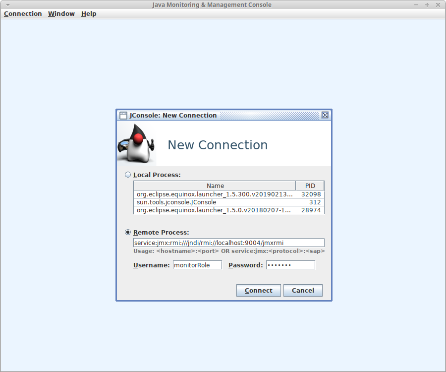
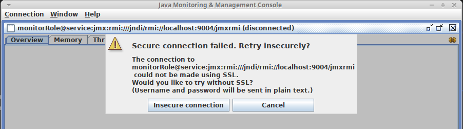
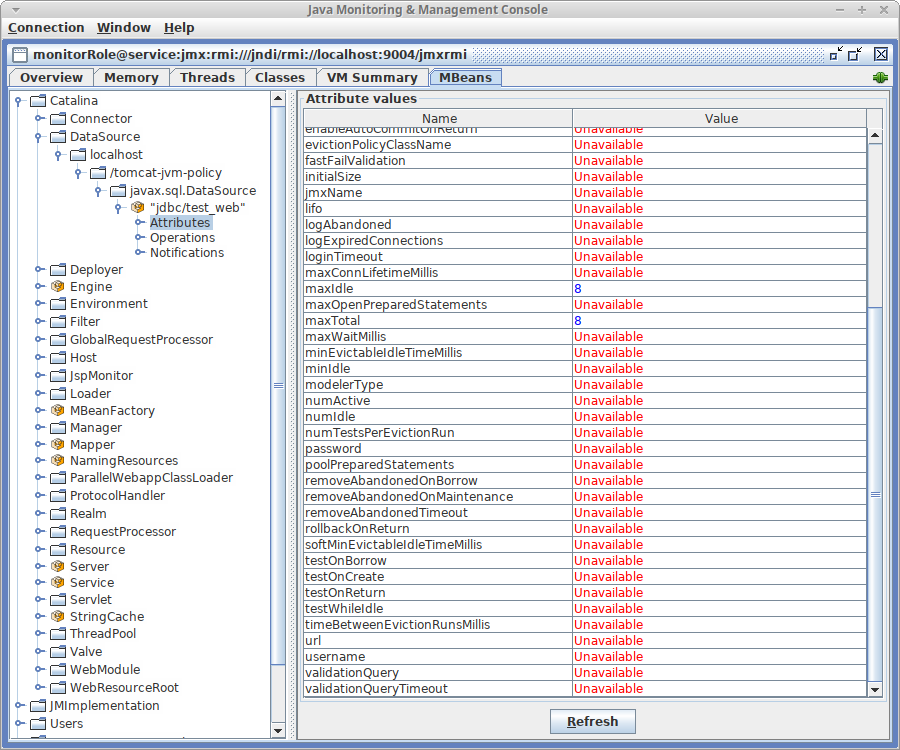

# java-jmx-policy

Este proyecto Java permite observar diferentes accesos a los datos expuestos con el mecanismo llamado [JMX](https://en.wikipedia.org/wiki/Java_Management_Extensions).

## Objetivo

El monitoreo de la aplicación no debe permitir a cualquier usuario ver información sensible (por ejemplo una password).
Se debe contar con diferentes perfiles para acceder a la información provista por la aplicación (java) o application server (tomcat).

## Detalles

Se ejecuta un [Apache Tomcat/8.5.41](https://hub.docker.com/_/tomcat) con modificaciones en archivo `$CATALINA_HOME/conf/catalina.policy`.  
Las modificaciones en archivo `catalina.policy` aplican al acceso de usuarios por medio de la clase `javax.management.remote.JMXPrincipal`.

Existe un usuario administrador `admin` que tiene acceso a toda la información. Luego otros usuarios (monitorRole, controlRole) con acceso restringido.

La aplicación alojada en tomcat es **java-jmx-policy** (.war). Desarrollada con Java/Maven y compilada en Java8.

**IMPORTANTE**

Otra opción para ocultar/denegar información de los objetos, es **quitar** el registro del **MBean** deseado. Para eso ver ejemplo en código fuente, actualmente comentado, ubicado en [java-jmx-policy/src/main/java/janusky/MBeanContextListener.java](src/main/java/janusky/MBeanContextListener.java)

>```java
>final MBeanServer mbeanServer = ManagementFactory.getPlatformMBeanServer();
>ObjectName query = new ObjectName("Catalina:class=javax.sql.DataSource,*");
>Set<ObjectName> queryNames = mbeanServer.queryNames(query, null);
>for (Iterator<ObjectName> iter = queryNames.iterator(); iter.hasNext();{
>	ObjectName objName = iter.next();
>	if (objName.toString().contains("jdbc")) {
>		mbeanServer.unregisterMBean(objName);
>	}
>}
>```

Observar este comporatmiento navengando entre las páginas indicadas

* http://localhost:8080/java-jmx-policy/ - Si docker-compose up -d
* http://localhost:8080/ - Si mvn tomcat7:run-war

## Run

Utilizando [Docker](https://www.docker.com/) se ejecuta un [Apache Tomcat](http://tomcat.apache.org/) con aplicación ejemplo **java-jmx-policy**.

```sh
# Por única vez dar el permiso adecuado al archivo de claves
chmod 600 config/tomcat/jmxremote.password

# Ejecutar y construir (--build)
docker-compose up -d --build
```

## Demo

Debe contar con [JConsole](https://openjdk.java.net/tools/svc/jconsole/) que viene en la instalación de Java JDK. El mismo ubicado en `$JAVA_HOME/bin/jconsole`.

Datos de acceso

* controlRole/control, monitorRole/monitor, admin/admin
* service:jmx:rmi:///jndi/rmi://localhost:9004/jmxrmi

Ingresar con el usuario con acceso restringido (todos menos **admin**) a los objetos y sus atributos (por ejemplo DataSource.password).  
Repetir cambiando el usuario a administrador **admin/admin**.

```sh
# jconsole or $JAVA_HOME/bin/jconsole
jconsole
```



Aceptar la conexión insegura


Seleccionar la solapa MBeans, luego ingresar en la instancia DataSource


## Referencias

* <https://blog.lukaspradel.com/mbeans-in-tomcat/>
* <https://events.static.linuxfound.org/sites/events/files/slides/Monitoring%20Apache%20Tomcat%20with%20JMX.pdf>
* <https://docs.oracle.com/javadb/10.10.1.2/adminguide/radminjmxenablepwd.html>
